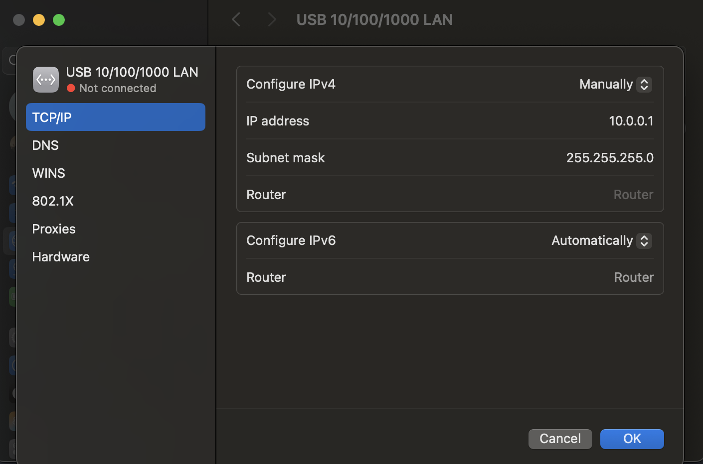

# Ports:

To find the USB serial device

'''
ls /dev/cu.*
'''

Run the meshtastic bridge:
'''python -m bridge.meshtastic_bridge /dev/cu.usbmodemXXXX'''

Similar logic via Raspberry Pi 

If running into issues w/ meshtastic library, create a venv and pip install there. 
'''source venv/bin/activate'''

when nodes are directly connected, to view messages that's being written to sqlite db:
'''
sqlite3 backend/meshsos.db "select id,node_id,message_type,urgency,timestamp,payload from messages order by id desc limit 5;"
'''


for later:
- for position data likey change 'pub.subscribe(on_receive, "meshtastic.receive")' to ''pub.subscribe(on_receive, "meshtastic.receive.text")'
- figure out logic on raspberry pi


# MeshSOS: Raspberry Pi Bridge Deployment Guide
---

## 1. Initial Network Connection (Host Mac)
Since you are using a direct Ethernet connection with a USB-C adapter, follow these steps to establish the network link:

1.  **Enable Internet Sharing**: 
    * Go to **System Settings > General > Sharing**.
    * Click the **(i)** next to **Internet Sharing**.
    * Set **Share your connection from** to `Wi-Fi`.
    * Under **To devices using**, check your `USB 10/100/1000 LAN` (or the specific Ethernet adapter name).
    * Click **Done** and toggle the master switch to **ON**.
2.  **Verify the IP Bridge**: 
    * Open Terminal on your Mac and run: `ifconfig bridge100`.
    * Look for the `inet` address (typically `192.168.2.1`). This confirms your Mac is acting as the gateway.
    * The Raspberry Pi will almost always be assigned `192.168.2.2`.



---

## 2. Remote Access (SSH)
Connect to the Pi from your Mac terminal using the project credentials:

```bash
ssh syde-capstone@192.168.2.2

password: capstone18

## 3. Environemnt and Dependency Setup
Once logged into the Pi, run these commands to install the necessary libraries for the Meshtastic API:

# Update the package repository
sudo apt update

# Install required Python libraries
# Use --break-system-packages for the current Raspberry Pi OS version
pip install meshtastic pydantic --break-system-packages

## 4. Deploy & Run Bridge

1. Transfer the Script (in a NEW terminal tab)
scp ~/Downloads/meshtastic_bridge.py syde-capstone@192.168.2.2:~/

2. Connect Hardware: Plug the Heltec Wireless LoRa tracker (ESP32S3 + SX1262) into one of the Pi's blue USB 3.0 ports.

3. Find the Serial Port 
ls /dev/ttyACM*

Note: Usually this is /dev/ttyACM0

4. Run the Bridge 

python3 meshtastic_bridge.py /dev/ttyACM0